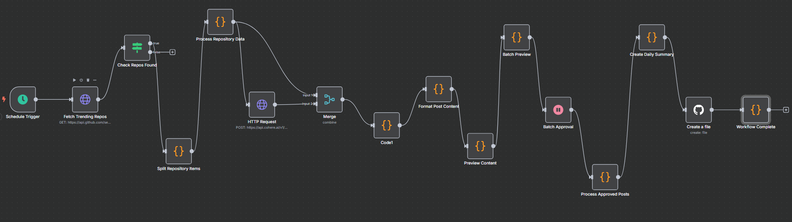

<h1 align="center">🤖 AutoGrow AI/ML GitHub Trends Workflow</h1>

  

  <b>Automated curation of trending AI, ML, and Data Science repositories from GitHub</b> 
  🚀 Daily digests | 📊 Category-aware summaries | 🔒 Token-safe workflow

---

## ✨ Overview

**AutoGrow AI/ML GitHub Trends Workflow** is a production-ready n8n automation that:

- ✅ Fetches trending AI/ML/Data Science repos from GitHub
- ✅ Categorizes by ML, DL, NLP, CV, Data Science, and more
- ✅ Generates technical summaries using LLMs (Cohere, etc.)
- ✅ Outputs daily markdown digests for your community or team
- ✅ Keeps your API keys and tokens safe (see `.gitignore`)

To see the results, go to [https://github.com/drago-Codes/daily-ai-trends](https://github.com/drago-Codes/daily-ai-trends)

---

## 🚀 Features

- 🤖 **Automated GitHub Search** – Finds new, high-star AI/ML repos daily
- 🧠 **Smart Categorization** – Tags repos by ML, DL, NLP, CV, etc.
- 📝 **LLM Summaries** – Uses Cohere or similar LLMs for concise, technical writeups
- 📅 **Batch Digest** – Produces a markdown summary for easy sharing
- 🔒 **Token Redaction** – Sensitive keys are never committed (see `.gitignore`)
- ⚡ **n8n Workflow** – Fully visual, customizable, and extendable

---

## 🛠️ Tech Stack

| Layer         | Technology         |
|---------------|-------------------|
| ⚙️ Workflow   | n8n (JSON export)  |
| 🗃️ Data Source | GitHub API         |
| 🧠 AI Engine  | Cohere LLM (or swap for OpenAI, etc.) |
| 📄 Output     | Markdown digests   |
| 🔒 Security   | .gitignore, token redaction |

---

## 🧪 Example Workflow

1. Scheduled trigger starts the workflow (daily or custom interval)
2. Fetches trending repos from GitHub (AI/ML/Data Science focus)
3. Splits and processes each repo, categorizing by topic
4. Generates technical summaries using an LLM
5. Batches results into a markdown digest
6. Optionally commits the digest to a GitHub repo

---

## 🧰 Usage

### 🔧 Import into n8n

1. Open your n8n instance
2. Import `n8n-github.json` (File > Import from File)
3. Set up your GitHub and Cohere (or LLM) API credentials in n8n
4. Adjust schedule, categories, or output as needed
5. Run the workflow manually or on a schedule

### 🛡️ Security

- `n8n-github.json` is in `.gitignore` – your secrets are safe
- All API tokens/keys are redacted in version control

---

## 📂 Project Structure

- `n8n-github.json` – n8n workflow export (keep this secret!)
- `.gitignore` – excludes sensitive files and junk
- `README.md` – this file

---

## 🤝 Contributing

PRs and suggestions welcome! Fork, tweak, and share your improvements.

---

## 📣 Credits

- Built with [n8n](https://n8n.io/)
- Uses [GitHub API](https://docs.github.com/en/rest)
- Summaries powered by [Cohere](https://cohere.com/) (swap for your LLM of choice)

---

*Curated by AutoGrow AI Agent for the Data Science & ML Community* 